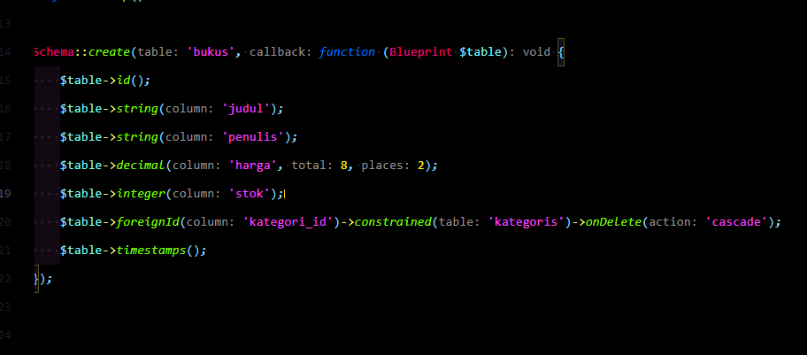
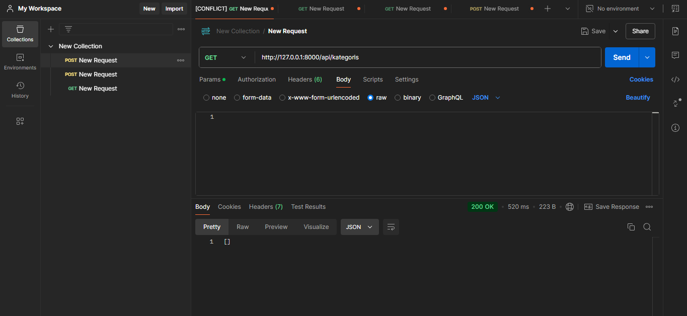
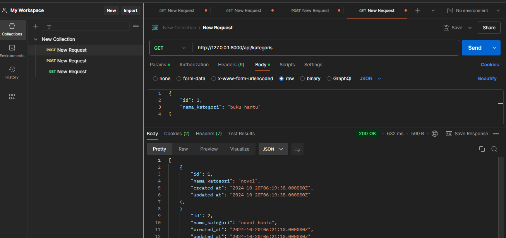
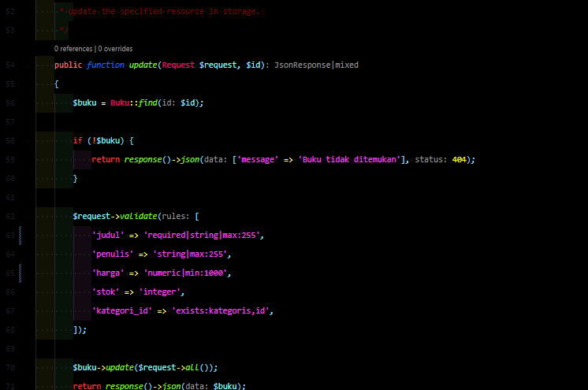

membuat konfigurasi toko buku dengan api menggunakan laravel

lalu php artisan serve

menambah table ke database

atur penghubung antara database

apabila error ganti collation seperti ini

migrate table

membuat model

membuat table buku dan  category

membuat controller

buat isi controler
<h1>penting</h1>

<h3>untuk api nya jangan dibuat manual. buat secara terminal dengan sintak php artisan install:api</h3>

buat file untuk api dan tambahkan isian seperti itu

hasil yang telah benar dibuat
<h3>get,post,delete pada postman</h3>

di atas adalah get pada url nya

post untuk url

get data lagi sesudah di tambahkan

menambahkan bagian bukus

mengupdate bukus
s
delete id buku ke 2

nama buku tidak boleh kosong dan min 1000

tidak bisa menambhkanbuku karena angka nya kurang dari 1000

tidak bisa menambahkan bku karena tidak ada  nama buku

menambahkan filter mencari dengan judul atau kategori

kode menambahkan search untuk memNGGIL BERDASARKAN KATEGORY

menambahkan search untuk memnggil berdasarkan kategory
Performa: Optimalkan query dengan indeks dan paginasi untuk menghindari beban berlebih saat data besar.
Skalabilitas: Gunakan caching dan load balancer untuk menangani trafik tinggi dan pertumbuhan data.
Pengalaman Pengguna: Terapkan debounce di frontend, gunakan paginasi, dan tampilkan hasil yang relevan dengan pencarian.
Keamanan: Validasi input dan terapkan rate limiting untuk mencegah penyalahgunaan.
link: https://nt9nrhxb-8000.asse.devtunnels.ms/

hasil nya menggunakan online menggunakan port pada vscode
